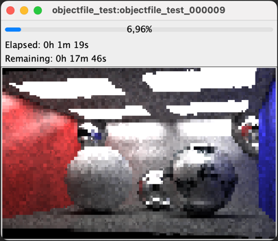

# PathtracerMonitor

This is a helper application for my pathtracer, but It is really agnostic to any type of image rendering.

It listens on pixelinformation broadcasts on UDP and renders them in an image window.

.PathtracerMonitor showing continuous progress during render.

NOTE:: This is only a monitor asynchronously showing image render progress of a separate running application. As such pixel information in this application can be lost due to late start of the monitor (some pixel information can already be sent by the render application).
Pixel information can also be lost as UDP packets can be lost over network or hardware network buffers may overflow pruning UDP calls.

It is a useful tool to quickly check render progress and quality before complete image is done.

## Broadcast listening

It listens to UDP broadcasts on `230.0.0.0:9999`.

## Broadcast packet format

The pixel information sent is encoded in a json structure.

`Image group` and `Image name` are keys to address a specific image. The monitor can listen to many broadcast sources and show a seperate render window for each `Image group`+`Image name` key there is.

Pixel color information is expected to be integers for RGB (red, green, and blue respectively) each in the range (0, 255).

The pixel x value is expected to be in the range (0, width[.
The pixel y value is expected to be in the range (0, height[.

.JSon format for a pixel packet
[source,go]
----
message := struct {
    ImageGroup  string   `json:"imageGroup"`
    ImageName   string   `json:"imageName"`
    ImageWidth  int      `json:"imageWidth"`
    ImageHeight int      `json:"imageHeight"`
    X           int      `json:"x"` // Top left corner of "pixel" square to render
    Y           int      `json:"y"`  // Top left corner of "pixel" square to render
    PixelWidth  int      `json:"pixelWidth"`  // Width of "pixel" square to render
    PixelHeight int      `json:"pixelHeight"` // Height of "pixel" square to render
    Color       [3]uint8 `json:"color"`
}
----